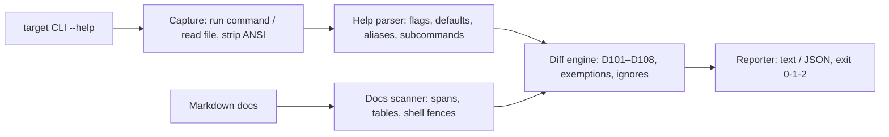

# flagdrift

[English](README.md) | [中文](README.zh.md) | [日本語](README.ja.md)

[](LICENSE)  [](CHANGELOG.md)  [](CONTRIBUTING.md)

**flagdrift：CLI ドキュメントのドリフトゲートを担うオープンソースツール — ツールが実際に出力する `--help` と Markdown ドキュメントが約束するフラグを突き合わせ、食い違えば CI を失敗させる。**


```bash
# not yet on npm — install from a checkout of this repository
npm install && npm run build && npm pack
npm install -g ./flagdrift-0.1.0.tgz
```

## なぜ flagdrift？

フラグが変わった瞬間、CLI ドキュメントは嘘をつき始める。`--concurrent` に改名しても README には `--concurrency` が残り、デフォルトを 30 から 60 に上げても参照表は 30 のまま、`--timeout` を廃止してもクイックスタートは推奨し続ける — その嘘の一つひとつがユーザーに失敗コマンドを踏ませ、あなたにバグ報告を運んでくる。既存ツールはどれも間違った端から攻めている：出力貼り込み系（cog、embedme）はキャプチャした出力をマーカー領域に貼るだけで手書き部分は一切検査せず、フレームワークのドキュメント生成器（cobra の Markdown ツリー、clap mangen）は誰も読まない別ページ群を吐く間に本物の README が腐り、CLI スナップショットツールは出力を凍結するだけでドキュメントを読まない。flagdrift は本当のループを閉じる：指定された 1 本の help コマンドを実行し、印字されたフラグ表面を解析（GNU、clap、argparse、Go flag、cobra、commander の 6 方言 — 設定不要）、手書き Markdown が約束するフラグを走査（コードスパン、デフォルト付き参照表、シェルフェンス）し、両者の差分をパイプラインがゲートできる安定コード付き finding にする。

|  | flagdrift | 出力貼り込み系（cog、embedme） | フレームワーク生成器 | CLI スナップショット |
|---|---|---|---|---|
| 手書きの本文と表を検査 | はい — スパン・表・フェンス | いいえ — 自分のマーカー領域のみ | いいえ — 生成するだけで検査しない | いいえ — ドキュメントは見えない |
| どの言語のどの CLI にも | はい — 印字された --help を解析 | はい | いいえ — 各々 1 フレームワーク | はい |
| ドキュメント内の幽霊フラグを検出 | はい（D102、did-you-mean 付き） | いいえ | いいえ | いいえ |
| 表の古いデフォルト値を検出 | はい（D103、書式に寛容） | いいえ | 該当なし | いいえ |
| ドキュメントへのマーカー/注記 | 不要 | 領域ごとに必要 | 該当なし | スナップショットごとに必要 |
| CI 判定 | exit 0/1/2 + 安定 JSON | diff ノイズ | なし | スナップショット毎の pass/fail |
| ランタイム依存 | 0 | まちまち | フレームワーク本体 | まちまち |

<sub>各ツール群の能力は公開ドキュメントに照らして確認、2026-07。</sub>

## 特徴

- **ユーザーが実際に見る help を読む** — `mycli --help` を実行（または保存済み help ファイルを読み込み）、GNU/getopt、clap v4、Python argparse、Go flag パッケージ、cobra、commander の方言に対応：短/長フラグの対、`[default: …]`、`[possible values: …]`、`[aliases: …]`、`--[no-]` 反転対、`{choice}` プレースホルダ、次行の説明、非推奨マーカー。
- **人間と同じ読み方でドキュメントを読む** — フラグはインラインコードスパン・参照表・シェルフェンスに現れて初めて「記載済み」；デフォルト値は見出しに "Default" を含む列から取り出し、その行の長いフラグに紐付ける。
- **8 つの安定したドリフトコード** — 未記載フラグ、幽霊フラグ、古いデフォルト、値形状のずれ、欠落/幽霊サブコマンド、注記なき非推奨、隠れた短縮形；各 finding は file:line と修正案を携え、可能なら did-you-mean も付く。
- **再現率より精度** — 本文のダッシュ、キャプチャ出力を収めた `text` フェンス、フェンス内コメント、HTML コメントからフラグが捏造されることはない；`--help`/`--version` と自動生成の `help`/`completion` サブコマンドは双方向で免除。
- **CI のために、依存ゼロで** — 決定的な出力、形状が安定した `--format json`、`--fail-on error|warning|info|never`、`--ignore` のワイルドカード、終了コード 0/1/2；必要なのは Node.js だけで、起動されるプロセスは指定した help コマンドただ一つ。
- **自分のドッグフードを食べる** — 同梱のスモークテストは毎回 flagdrift 自身の `--help` を [docs/cli.md](docs/cli.md) と突き合わせる。このリポジトリは自分が治す病気に罹れない。

## クイックスタート

インストール：

```bash
# not yet on npm — install from a checkout of this repository
npm install && npm run build && npm pack
npm install -g ./flagdrift-0.1.0.tgz
```

CLI とそのドキュメントを指す（ここでは同梱のトイ CLI `shipctl`、そのドキュメントはドリフト済み）：

```bash
cd examples/demo
flagdrift check --cmd "node democli.mjs --help" --docs docs/drifted.md
```

出力（実際の実行記録、9 件の finding から 4 件を抜粋）：

```text
flagdrift: shipctl — 11 help flags, 3 commands vs 1 docs file

  error D101 --retries
      `--retries <N>` is in the live --help but never appears in the docs
      fix: add it to the flag reference (default: 3), or pass --ignore '--retries'

  error D102 docs/drifted.md:10 › --concurrency
      the docs mention `--concurrency` but the live --help has no such flag
      fix: update or remove the reference — it fails for anyone who copies it

  warning D103 docs/drifted.md:24 › --timeout
      the docs say the default for `--timeout` is `60`, but --help says `30`
      fix: update the table cell to `30`

  info D107 docs/drifted.md:24 › --timeout
      --help marks `--timeout` deprecated, but the docs present it without a deprecation note
      fix: add a deprecation note next to the documented flag

flagdrift: FAIL — 3 errors, 3 warnings, 3 info (fail-on: warning)
```

終了コード 1 — そのまま CI に入れられる。誠実な双子 `docs/good.md` は finding ゼロで 0 終了する。再現可能な運用にはターゲットを列挙した `flagdrift.json` をコミットして素の `flagdrift check` を実行；finding が腑に落ちないときは `flagdrift parse` と `flagdrift docs` が diff の両側を見せてくれる。その他のシナリオは [examples/](examples/README.md) に。

## ドリフトコード

error はドキュメントが今まさに間違っていること、warning は誤解を招くこと、info は磨き込み項目を意味する。コードは安定 API で番号の付け替えはしない；`flagdrift explain <code>` が各コードをオフラインで解説し、設計根拠の全文は [docs/codes.md](docs/codes.md) にある。

| コード | 深刻度 | 発火条件 |
|---|---|---|
| D101 | error | 実際の `--help` のフラグが走査対象のどの Markdown にも現れない |
| D102 | error | ドキュメントが言及するフラグが実際の `--help` に存在しない |
| D103 | warning | 参照表のデフォルト値が `--help` の宣言と異なる |
| D104 | warning | `--help` がブール型と宣言するフラグに値を付けている |
| D105 | warning | `Commands:` のサブコマンドがドキュメントで一度も呼ばれない |
| D106 | error | `--help` に載っていないサブコマンドをドキュメントが呼んでいる |
| D107 | info | 非推奨フラグが非推奨の注記なしに記載されている |
| D108 | info | 短縮形が存在するのにドキュメントが一度も見せない |

## CLI リファレンス

`flagdrift check` がデフォルトのサブコマンド；`parse` は `--help` テキストから復元した表面を、`docs` は Markdown で見つかったフラグを印字し、`explain` は任意のコードを解説する。完全なリファレンスは [docs/cli.md](docs/cli.md) にあり、それ自体がスモークテストでドリフトゲートされている。

| フラグ | デフォルト | 効果 |
|---|---|---|
| `--cmd` / `--help-file` | — | help の供給源：シェルコマンド、または保存済み help テキスト |
| `--docs <GLOB>` | — | 走査する Markdown ファイルまたは glob；繰り返し可 |
| `-c, --config <FILE>` | `flagdrift.json` | アドホックなフラグの代わりのマルチターゲット設定 |
| `--ignore <NAME>` | — | フラグやサブコマンドを黙らせる；末尾 `*` は前方一致 |
| `--sections <LIST>` | — | 一致する見出しの配下だけを走査 |
| `--fail-on <LEVEL>` | `warning` | 終了コードを 1 に反転させる深刻度；`never` は報告のみ |
| `--format <FMT>` | `text` | 人間には `text`、パイプラインには `json` |

終了コード：`0` ゲート以上のドリフトなし、`1` ドリフト検出、`2` 用法または実行エラー — パイプラインはドキュメントの腐敗とコマンドの書き間違いを区別できる。

## アーキテクチャ



## ロードマップ

- [x] 6 方言の help パーサ、精度優先の Markdown スキャナ、8 つの安定ドリフトコード、アドホック + 設定ファイルのターゲット、JSON 出力、`parse`/`docs`/`explain` サブコマンド、セルフドッグフードのスモークテスト（v0.1.0）
- [ ] サブコマンドの help（`mycli push --help`）へ再帰し、各自のドキュメント章と突き合わせ
- [ ] `--fix`：欠けている参照表の行を追記し、古いデフォルト値セルをその場で更新
- [ ] `--help` に加えて man ページと `--help-all` 入力に対応
- [ ] ベースラインファイルで、既にドリフトのあるリポジトリにも段階導入

完全なリストは [open issues](https://github.com/JaydenCJ/flagdrift/issues) を参照。

## コントリビュート

コントリビューション歓迎。`npm install && npm run build` でビルドし、`npm test`（90 テスト）と `bash scripts/smoke.sh`（`SMOKE OK` を印字すること）を実行 — このリポジトリは CI を同梱せず、上記の主張はすべてローカル実行で検証されている。[CONTRIBUTING.md](CONTRIBUTING.md) を読み、[good first issue](https://github.com/JaydenCJ/flagdrift/issues?q=is%3Aissue+is%3Aopen+label%3A%22good+first+issue%22) を拾うか、[discussion](https://github.com/JaydenCJ/flagdrift/discussions) を始めてほしい。

## ライセンス

[MIT](LICENSE)
