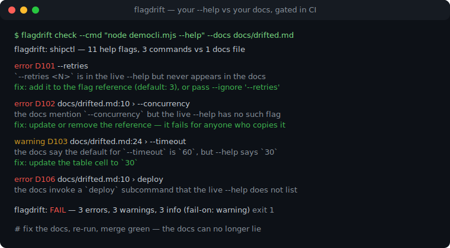
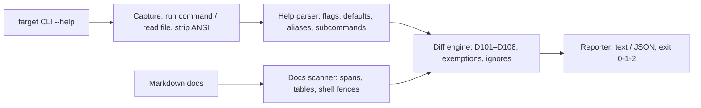

# flagdrift

[English](README.md) | [中文](README.zh.md) | [日本語](README.ja.md)

[](LICENSE)  [](CHANGELOG.md)  [](CONTRIBUTING.md)

**flagdrift：an open-source drift gate for CLI docs — diffs the `--help` your tool actually prints against the flags your Markdown documents, and fails CI when they disagree.**



```bash
# not yet on npm — install from a checkout of this repository
npm install && npm run build && npm pack
npm install -g ./flagdrift-0.1.0.tgz
```

## Why flagdrift?

CLI docs lie the moment a flag changes. You rename `--concurrent`, the README keeps `--concurrency`; you bump a default from 30 to 60, the reference table keeps 30; you deprecate `--timeout` and the quickstart keeps recommending it — and every one of those lies costs a user a failed command and you a bug report. The existing tooling attacks this from the wrong ends: output-stamping tools (cog, embedme) paste captured output into marked regions but check nothing you wrote by hand; framework doc generators (cobra's Markdown tree, clap mangen) emit a parallel set of pages nobody reads while your real README rots; and CLI snapshot tools freeze output without ever reading your docs. flagdrift closes the actual loop: it runs the one help command you give it, parses the printed flag surface (GNU, clap, argparse, Go flag, cobra and commander dialects — no configuration), scans your hand-written Markdown for the flags it promises (code spans, reference tables with their defaults, shell fences), and diffs the two into stable-coded findings a pipeline can gate on.

|  | flagdrift | output stampers (cog, embedme) | framework doc generators | CLI snapshot tools |
|---|---|---|---|---|
| Checks hand-written prose and tables | yes — spans, tables, fences | no — only marked regions they own | no — they generate, never check | no — docs are invisible to them |
| Works with any CLI, any language | yes — parses the printed --help | yes | no — one framework each | yes |
| Catches phantom flags in docs | yes (D102, with did-you-mean) | no | no | no |
| Catches stale defaults in tables | yes (D103, format-forgiving) | no | n/a | no |
| Needs markers/annotations in docs | none | yes, per region | n/a | yes, per snapshot |
| CI verdict | exit 0/1/2 + stable JSON | diff noise | none | pass/fail per snapshot |
| Runtime dependencies | 0 | varies | framework itself | varies |

<sub>Capability notes checked against each tool family's public documentation, 2026-07.</sub>

## Features

- **Reads the help your users actually see** — runs `mycli --help` (or a saved help file), tolerating the dialects of GNU/getopt, clap v4, Python argparse, Go's flag package, cobra and commander: short/long pairs, `[default: …]`, `[possible values: …]`, `[aliases: …]`, `--[no-]` negations, `{choice}` placeholders, next-line descriptions, deprecation markers.
- **Reads the docs the way a human does** — flags count as documented when they appear in inline code spans, reference tables or shell fences; defaults are lifted from any table column headed "Default" and pinned to the row's long flag.
- **Eight stable drift codes** — undocumented flag, phantom flag, stale default, value drift, missing/phantom subcommand, undeprecated deprecation, hidden short alias; each finding carries a file:line, a fix, and a did-you-mean where one exists.
- **Precision over recall** — prose dashes, `text` fences holding captured output, fence comments and HTML comments can never fabricate a flag; `--help`/`--version` and auto-generated `help`/`completion` subcommands are exempt in both directions.
- **Built for CI, zero dependencies** — deterministic output, `--format json` with a stable shape, `--fail-on error|warning|info|never`, `--ignore` wildcards, exit codes 0/1/2; Node.js is the only requirement and the only process spawned is the help command you name.
- **It eats its own dog food** — the bundled smoke test diffs flagdrift's own `--help` against [docs/cli.md](docs/cli.md) on every run, so this repository cannot ship the disease it cures.

## Quickstart

Install:

```bash
# not yet on npm — install from a checkout of this repository
npm install && npm run build && npm pack
npm install -g ./flagdrift-0.1.0.tgz
```

Point it at a CLI and its docs (here, the bundled toy `shipctl` whose docs drifted):

```bash
cd examples/demo
flagdrift check --cmd "node democli.mjs --help" --docs docs/drifted.md
```

Output (real captured run, abridged to 4 of the 9 findings):

```text
flagdrift: shipctl — 11 help flags, 3 commands vs 1 docs file

  error D101 --retries
      `--retries <N>` is in the live --help but never appears in the docs
      fix: add it to the flag reference (default: 3), or pass --ignore '--retries'

  error D102 docs/drifted.md:10 › --concurrency
      the docs mention `--concurrency` but the live --help has no such flag
      fix: update or remove the reference — it fails for anyone who copies it

  warning D103 docs/drifted.md:24 › --timeout
      the docs say the default for `--timeout` is `60`, but --help says `30`
      fix: update the table cell to `30`

  info D107 docs/drifted.md:24 › --timeout
      --help marks `--timeout` deprecated, but the docs present it without a deprecation note
      fix: add a deprecation note next to the documented flag

flagdrift: FAIL — 3 errors, 3 warnings, 3 info (fail-on: warning)
```

Exit code 1 — drop it into CI as-is. The truthful twin `docs/good.md` exits 0 with zero findings. For repeatable runs, commit a `flagdrift.json` listing your targets and run bare `flagdrift check`; `flagdrift parse` and `flagdrift docs` show each side of the diff when a finding surprises you. More scenarios live in [examples/](examples/README.md).

## Drift codes

Errors mean the docs are wrong right now, warnings mean they mislead, info is polish. Codes are stable API, never renumbered; `flagdrift explain <code>` documents each one offline, and [docs/codes.md](docs/codes.md) has the full rationale.

| Code | Severity | Fires when |
|---|---|---|
| D101 | error | a live `--help` flag never appears in any scanned Markdown |
| D102 | error | the docs mention a flag the live `--help` does not have |
| D103 | warning | a reference-table default differs from the `--help` default |
| D104 | warning | the docs attach a value to a flag `--help` declares boolean |
| D105 | warning | a `Commands:` entry is never invoked in the docs |
| D106 | error | the docs invoke a subcommand `--help` does not list |
| D107 | info | a deprecated flag is documented without a deprecation note |
| D108 | info | a short form exists but the docs never show it |

## CLI reference

`flagdrift check` is the default subcommand; `parse` prints the surface recovered from a `--help` text, `docs` prints the flags found in Markdown, `explain` documents any code. The full reference, itself drift-gated by the smoke test, is in [docs/cli.md](docs/cli.md).

| Flag | Default | Effect |
|---|---|---|
| `--cmd` / `--help-file` | — | the help source: a shell command, or a saved help text |
| `--docs <GLOB>` | — | Markdown file or glob to scan; repeatable |
| `-c, --config <FILE>` | `flagdrift.json` | multi-target config instead of ad-hoc flags |
| `--ignore <NAME>` | — | silence a flag or subcommand; trailing `*` matches a prefix |
| `--sections <LIST>` | — | scan only content under matching headings |
| `--fail-on <LEVEL>` | `warning` | severity that flips the exit code to 1; `never` reports only |
| `--format <FMT>` | `text` | `text` for humans, `json` for pipelines |

Exit codes: `0` no drift at/above the gate, `1` drift found, `2` usage or execution error — so a pipeline can tell rotten docs from a broken invocation.

## Architecture



## Roadmap

- [x] Six-dialect help parser, precision-first Markdown scanner, eight stable drift codes, ad-hoc + config-file targets, JSON output, `parse`/`docs`/`explain` subcommands, self-dogfooding smoke test (v0.1.0)
- [ ] Recurse into subcommand helps (`mycli push --help`) and diff each against its own docs section
- [ ] `--fix`: append missing reference-table rows and update stale default cells in place
- [ ] Man page and `--help-all` inputs alongside `--help`
- [ ] Baseline file to adopt flagdrift incrementally on a repo with existing drift

See the [open issues](https://github.com/JaydenCJ/flagdrift/issues) for the full list.

## Contributing

Contributions are welcome. Build with `npm install && npm run build`, then run `npm test` (90 tests) and `bash scripts/smoke.sh` (must print `SMOKE OK`) — this repository ships no CI, every claim above is verified by local runs. See [CONTRIBUTING.md](CONTRIBUTING.md), grab a [good first issue](https://github.com/JaydenCJ/flagdrift/issues?q=is%3Aissue+is%3Aopen+label%3A%22good+first+issue%22), or start a [discussion](https://github.com/JaydenCJ/flagdrift/discussions).

## License

[MIT](LICENSE)
