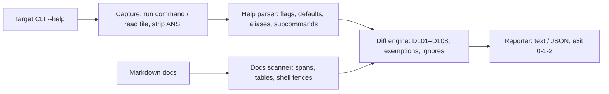

# flagdrift

[English](README.md) | [中文](README.zh.md) | [日本語](README.ja.md)

[](LICENSE)  [](CHANGELOG.md)  [](CONTRIBUTING.md)

**flagdrift：开源的 CLI 文档漂移门禁 — 把工具实际打印的 `--help` 与 Markdown 文档里承诺的 flag 逐一对比，二者不一致时让 CI 失败。**


```bash
# not yet on npm — install from a checkout of this repository
npm install && npm run build && npm pack
npm install -g ./flagdrift-0.1.0.tgz
```

## 为什么选 flagdrift？

flag 一变，CLI 文档立刻开始说谎。你把 `--concurrent` 改了名，README 里还留着 `--concurrency`；你把默认值从 30 提到 60，参考表里还写着 30；你废弃了 `--timeout`，快速上手却仍在推荐它 — 每一条谎言都让用户白跑一条失败的命令，让你多收一张 bug 报告。现有工具都从错误的两端下手：输出贴入工具（cog、embedme）只把捕获的输出贴进标记区域，对你手写的内容不做任何检查；框架文档生成器（cobra 的 Markdown 树、clap mangen）另外生成一套没人读的页面，而你真正的 README 继续腐烂；CLI 快照工具冻结输出，却从不读你的文档。flagdrift 闭合了真正的环：运行你指定的那一条 help 命令，解析打印出的 flag 表面（GNU、clap、argparse、Go flag、cobra、commander 六种方言 — 无需配置），扫描你手写的 Markdown 所承诺的 flag（代码 span、带默认值的参考表、shell 代码块），再把两侧 diff 成流水线可以门禁的稳定编码 finding。

|  | flagdrift | 输出贴入工具（cog、embedme） | 框架文档生成器 | CLI 快照工具 |
|---|---|---|---|---|
| 检查手写的正文和表格 | 是 — span、表格、代码块 | 否 — 只管自己的标记区域 | 否 — 只生成，从不检查 | 否 — 完全看不见文档 |
| 适用于任何语言的任何 CLI | 是 — 解析打印出的 --help | 是 | 否 — 各绑定一个框架 | 是 |
| 抓出文档里的幽灵 flag | 是（D102，带 did-you-mean） | 否 | 否 | 否 |
| 抓出表格里过期的默认值 | 是（D103，宽容格式差异） | 否 | 不适用 | 否 |
| 需要在文档里加标记/注解 | 不需要 | 需要，每个区域 | 不适用 | 需要，每个快照 |
| CI 判定 | exit 0/1/2 + 稳定 JSON | diff 噪音 | 无 | 每快照 pass/fail |
| 运行时依赖 | 0 | 不等 | 框架本体 | 不等 |

<sub>各工具族的能力说明依据其公开文档核对，2026-07。</sub>

## 特性

- **读用户真正看到的 help** — 运行 `mycli --help`（或读保存的 help 文件），兼容 GNU/getopt、clap v4、Python argparse、Go flag 包、cobra、commander 的方言：短/长 flag 配对、`[default: …]`、`[possible values: …]`、`[aliases: …]`、`--[no-]` 反义对、`{choice}` 占位符、下一行描述、废弃标记。
- **像人一样读文档** — flag 出现在行内代码 span、参考表或 shell 代码块里才算已记录；默认值从表头含 "Default" 的列提取，并绑定到该行的长 flag 上。
- **八个稳定的漂移码** — 未记录 flag、幽灵 flag、过期默认值、值形态漂移、缺失/幽灵子命令、未注明的废弃、隐身短别名；每条 finding 都带 file:line、修复建议，能给出时还附 did-you-mean。
- **精确优先于召回** — 正文里的破折号、装着捕获输出的 `text` 代码块、块内注释和 HTML 注释永远造不出 flag；`--help`/`--version` 与自动生成的 `help`/`completion` 子命令双向豁免。
- **为 CI 而生，零依赖** — 输出确定性、`--format json` 形状稳定、`--fail-on error|warning|info|never`、`--ignore` 通配、退出码 0/1/2；只需要 Node.js，唯一被启动的进程就是你指定的那条 help 命令。
- **自己吃自己的狗粮** — 自带的冒烟测试每次都拿 flagdrift 自己的 `--help` 对比 [docs/cli.md](docs/cli.md)，这个仓库不可能自己得上它要治的病。

## 快速上手

安装：

```bash
# not yet on npm — install from a checkout of this repository
npm install && npm run build && npm pack
npm install -g ./flagdrift-0.1.0.tgz
```

指向一个 CLI 和它的文档（这里用自带的玩具 `shipctl`，其文档已经漂移）：

```bash
cd examples/demo
flagdrift check --cmd "node democli.mjs --help" --docs docs/drifted.md
```

输出（真实运行记录，从 9 条 finding 节选 4 条）：

```text
flagdrift: shipctl — 11 help flags, 3 commands vs 1 docs file

  error D101 --retries
      `--retries <N>` is in the live --help but never appears in the docs
      fix: add it to the flag reference (default: 3), or pass --ignore '--retries'

  error D102 docs/drifted.md:10 › --concurrency
      the docs mention `--concurrency` but the live --help has no such flag
      fix: update or remove the reference — it fails for anyone who copies it

  warning D103 docs/drifted.md:24 › --timeout
      the docs say the default for `--timeout` is `60`, but --help says `30`
      fix: update the table cell to `30`

  info D107 docs/drifted.md:24 › --timeout
      --help marks `--timeout` deprecated, but the docs present it without a deprecation note
      fix: add a deprecation note next to the documented flag

flagdrift: FAIL — 3 errors, 3 warnings, 3 info (fail-on: warning)
```

退出码 1 — 原样丢进 CI 即可。诚实的孪生文档 `docs/good.md` 以 0 findings 退出 0。要可复现的运行，提交一份列出目标的 `flagdrift.json`，然后裸跑 `flagdrift check`；某条 finding 出乎意料时，`flagdrift parse` 和 `flagdrift docs` 分别展示 diff 的两侧。更多场景见 [examples/](examples/README.md)。

## 漂移码

error 表示文档此刻就是错的，warning 表示文档在误导，info 是打磨项。漂移码是稳定 API，从不重新编号；`flagdrift explain <code>` 离线解释每一条，完整设计依据见 [docs/codes.md](docs/codes.md)。

| 编码 | 严重度 | 触发条件 |
|---|---|---|
| D101 | error | 实际 `--help` 里的 flag 在所有被扫描的 Markdown 中从未出现 |
| D102 | error | 文档提到的 flag 在实际 `--help` 里不存在 |
| D103 | warning | 参考表里的默认值与 `--help` 声明的不同 |
| D104 | warning | 文档给 `--help` 声明为布尔的 flag 附了值 |
| D105 | warning | `Commands:` 里的子命令在文档中从未被调用 |
| D106 | error | 文档调用了 `--help` 未列出的子命令 |
| D107 | info | 已废弃的 flag 被记录却没有废弃说明 |
| D108 | info | 存在短形式但文档从未展示 |

## CLI 参考

`flagdrift check` 是默认子命令；`parse` 打印从 `--help` 文本恢复的表面，`docs` 打印 Markdown 里找到的 flag，`explain` 解释任意编码。完整参考在 [docs/cli.md](docs/cli.md)，它本身就被冒烟测试做漂移门禁。

| Flag | 默认值 | 效果 |
|---|---|---|
| `--cmd` / `--help-file` | — | help 来源：一条 shell 命令，或保存的 help 文本 |
| `--docs <GLOB>` | — | 要扫描的 Markdown 文件或 glob；可重复 |
| `-c, --config <FILE>` | `flagdrift.json` | 多目标配置文件，替代临时 flag |
| `--ignore <NAME>` | — | 静默某个 flag 或子命令；结尾 `*` 匹配前缀 |
| `--sections <LIST>` | — | 只扫描匹配标题之下的内容 |
| `--fail-on <LEVEL>` | `warning` | 把退出码翻成 1 的严重度阈值；`never` 只报告 |
| `--format <FMT>` | `text` | `text` 给人看，`json` 给流水线 |

退出码：`0` 门禁以上无漂移，`1` 发现漂移，`2` 用法或执行错误 — 流水线因此能区分文档腐烂和命令写错。

## 架构



## 路线图

- [x] 六方言 help 解析器、精确优先的 Markdown 扫描器、八个稳定漂移码、临时 + 配置文件目标、JSON 输出、`parse`/`docs`/`explain` 子命令、自我狗粮冒烟测试（v0.1.0）
- [ ] 递归进入子命令的 help（`mycli push --help`），逐一对比各自的文档章节
- [ ] `--fix`：就地补上缺失的参考表行、更新过期的默认值单元格
- [ ] 在 `--help` 之外支持 man page 与 `--help-all` 输入
- [ ] 基线文件，让已有漂移的仓库也能渐进采用 flagdrift

完整列表见 [open issues](https://github.com/JaydenCJ/flagdrift/issues)。

## 参与贡献

欢迎贡献。先 `npm install && npm run build` 构建，再跑 `npm test`（90 个测试）和 `bash scripts/smoke.sh`（必须打印 `SMOKE OK`）— 本仓库不带 CI，上面的每一条主张都由本地运行验证。参见 [CONTRIBUTING.md](CONTRIBUTING.md)，认领一个 [good first issue](https://github.com/JaydenCJ/flagdrift/issues?q=is%3Aissue+is%3Aopen+label%3A%22good+first+issue%22)，或发起一个 [discussion](https://github.com/JaydenCJ/flagdrift/discussions)。

## 许可证

[MIT](LICENSE)
